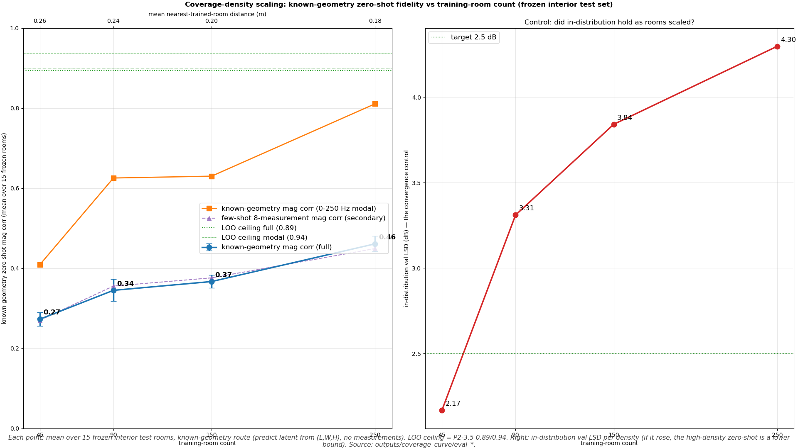

# P2-4 — Coverage-density scaling curve

Known-geometry zero-shot fidelity (predict latent from (L,W,H), no measurements) on a FROZEN interior test set (15 rooms, inside the 45-hull, interpolative at every density), as training-room count scales 45→90→150→250 with the recipe frozen.

✅ **STATUS: COMPLETE — all 4/4 densities measured.**

> **Fixed-budget caveat (read before interpreting):** the iteration budget is held lean and *fixed* (45/90→60K, 150→70K, 250→85K) while the room count rises, so per-room sample exposure *falls* as density grows. In-distribution val LSD is therefore NOT constant across the curve (see the control column) and no point is guaranteed converged — early-stop did not fire for 45 or 90 (both still descending at their final iter). Treat every zero-shot point as a **lower bound**; the higher its in-dist LSD, the looser the bound. That fidelity still *climbs* as rooms rise — despite falling per-room exposure — makes the coverage signal a conservative read, not an inflated one.

## Scaling table

| rooms | mean NN-dist (m) | in-dist val LSD (dB) | mag corr full | mag corr modal (0-250) | phase corr | RIR Pearson |
|---:|---:|---:|---:|---:|---:|---:|
| 45 | 0.260 | 2.17 @60K | 0.273 | 0.409 | 0.125 | 0.130 |
| 90 | 0.236 | 3.31 @60K | 0.345 | 0.625 | 0.210 | 0.250 |
| 150 | 0.200 | 3.84 @70K | 0.367 | 0.630 | 0.256 | 0.304 |
| 250 | 0.178 | 4.30 @85K | 0.461 | 0.811 | 0.348 | 0.421 |

**LOO ceiling (P2-3.5, training density):** mag corr 0.894 full / 0.938 modal.

## Few-shot 8-measurement route (secondary, for completeness)

Same frozen rooms, but the latent is fitted from 8 observed receivers (test-time optimization) instead of predicted from (L,W,H). Reported for completeness; the headline is the known-geometry route above.

> **Not a like-for-like overlay with the known-geometry column.** The few-shot mag corr is measured over the **504 held-out** receivers (the 8 observed/fitted receivers are excluded); the known-geometry mag corr above is over **all 512** receivers. Same metric function, band (0–2 kHz), and pooling — only the receiver population differs. So near-parity (e.g. few-shot slightly *above* known-geometry at 90 rooms) does not mean the few-shot route is better — it is scored on a strictly harder (unfitted) receiver set.

| rooms | n | mag corr (full) | phase corr (mw) | RIR Pearson | held-out LSD (dB) |
|---:|---:|---:|---:|---:|---:|
| 45 | 15 | 0.270 | 0.106 | 0.115 | 7.24 |
| 90 | 15 | 0.355 | 0.241 | 0.281 | 6.81 |
| 150 | 15 | 0.376 | 0.251 | 0.296 | 7.27 |
| 250 | 15 | 0.449 | 0.339 | 0.406 | 6.46 |

## Reading

- Known-geometry mag corr moves **0.27 → 0.46** (full) from 45 → 250 rooms; the LOO ceiling is 0.89.

- **Convergence control (fixed lean budget, NOT held constant)**: in-distribution val LSD spans 2.17–4.30 dB across the measured densities and *rises* with room count (per-room exposure falls). Because early-stop did not fire, every point is a lower bound — the 250-room point (LSD 4.30) is the loosest. The zero-shot climb is therefore a **conservative** coverage signal, not an artifact of better convergence at higher density.

- Saturation / per-room view / P3-1 setup / recommendation: see tasks/CHUNK_P2_4_RESULTS.md.
