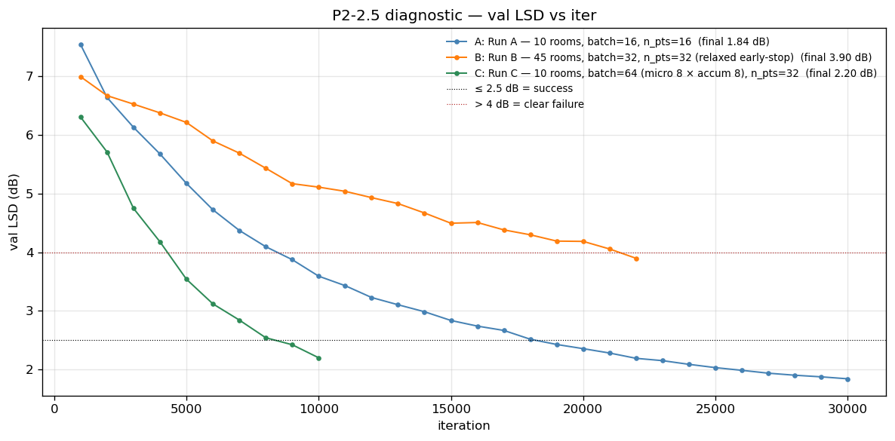
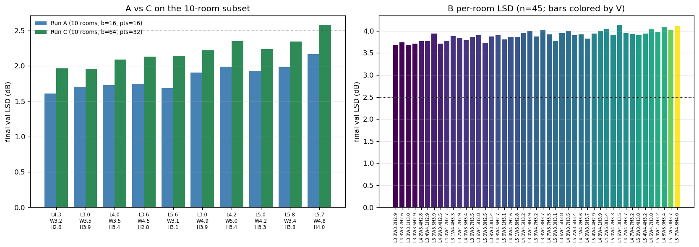

# P2-2.5 DIAGNOSIS — multi-room 3D training bottleneck

> **INTERIM snapshot — A complete; B and C still training. Verdict is provisional; final DIAGNOSIS.md follows when the safe 24h runs (and the DDP-B speedup attempt) finish.**

## Headline
| Run | Rooms | batch | n_pts | iters / target | wall | final val LSD | classification |
|---|---:|---:|---:|---|---:|---:|---|
| A | 10 | 16 × accum 2 | 16 | 30000/30000 | 6.6 h | 1.84 dB | ✅ success |
| B | 45 | 32 × accum 4 | 32 | ~22000/60000 (in progress) | running | 3.90 dB | ⚠ ambiguous · still descending |
| C | 10 | 64 × accum 8 | 32 | ~10000/30000 (in progress) | running | 2.20 dB | ✅ success · still descending |

**Thresholds (spec)**: `≤ 2.5 dB = success`; `> 4 dB = clear failure`; in-between = ambiguous, flag for manager.

## Decision-matrix verdict

**Mixed signal — A=success, B=ambiguous, C=success.**

### Recommendation for P2-3

Refer the manager to the per-room breakdown; specific rooms left behind in B but not A/C indicate a room-count effect; uniform failure across all three points to capacity.

## Convergence curves

## Per-room final val LSD

## Per-run details

### Run A — 10 rooms, batch=16, n_pts=16

- Output dir: `outputs/diag_p2_2_5/A_10rm_b16/`
- Wall-clock: 6.65 h (30000/30000 iters)
- Stopped early: `False`
- Final val LSD: **1.84 dB**

### Run B — 45 rooms, batch=32, n_pts=32 (relaxed early-stop)

- Output dir: `outputs/diag_p2_2_5/B_45rm_b32/`
- Wall-clock: nan h (0/0 iters)
- Stopped early: `False`
- Final val LSD: **3.90 dB**

### Run C — 10 rooms, batch=64 (micro 8 × accum 8), n_pts=32

- Output dir: `outputs/diag_p2_2_5/C_10rm_b64/`
- Wall-clock: nan h (0/0 iters)
- Stopped early: `False`
- Final val LSD: **2.20 dB**

## Anchors (other multi-room results)

- P2-1 single-room overfit (5 rooms, batch=4-8, n_pts=16): val LSD **1.3-1.8 dB** — the architecture can reconstruct 3D spectra.
- P2-2 M1 (45 rooms, batch=4, n_pts=16): val LSD **6.16 dB** after 24K iters (early-stop). This is the baseline P2-2.5 is trying to beat.
