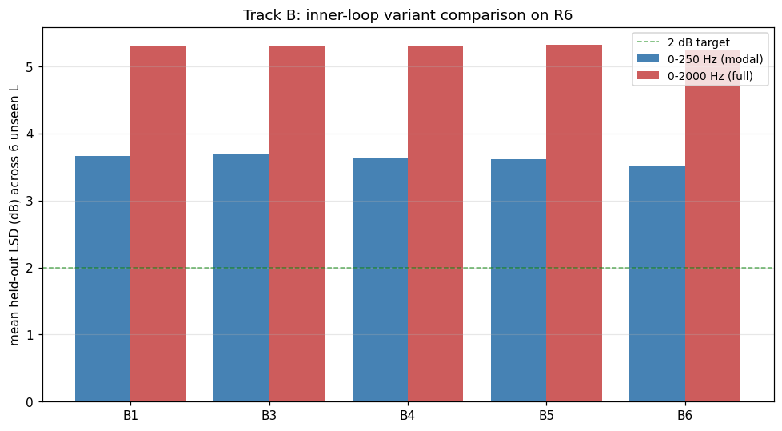

# Track B summary — inner-loop variants on R6_tiny_lhead

Winner: **B6** (z_star = softmax(logits) @ Z_train (simplex)). Reason: lowest mean modal_held_mean=3.523 (modal count ≤ 2 dB: 0)

| Variant | Description | n L | mean obs LSD | mean full held LSD | count full ≤ 2 dB | mean 0-250 Hz held LSD | count modal ≤ 2 dB | count modal ≤ 3 dB | winner |
|---|---|---:|---:|---:|---:|---:|---:|---:|:---:|
| B1 | baseline (8 obs, 2K iters, random init) | 6 | 4.82 | 5.30 | 0/6 | 3.66 | 0/6 | 0/6 |  |
| B3 | 10K inner iters (was 2K) | 6 | 4.83 | 5.31 | 0/6 | 3.70 | 0/6 | 0/6 |  |
| B4 | 10 random restarts, keep best obs LSD | 6 | 4.81 | 5.31 | 0/6 | 3.63 | 0/6 | 0/6 |  |
| B5 | init z_star from nearest-L training latent | 6 | 4.82 | 5.32 | 0/6 | 3.62 | 0/6 | 0/6 |  |
| B6 | z_star = softmax(logits) @ Z_train (simplex) | 6 | 4.84 | 5.24 | 0/6 | 3.52 | 0/6 | 0/6 | ✅ |

## Headline figure

## Notes

- All variants run on the same trained R6 checkpoint; only the inner-loop
  procedure differs.
- 'modal' = LSD restricted to 0-250 Hz (the band where Track A finds
  visually-correct tracking).
- The winner's kwargs are written to `best_variant.txt` and consumed by
  `scripts/zero_shot_with_best_variant.py` for evaluating Track-C trained
  models.
