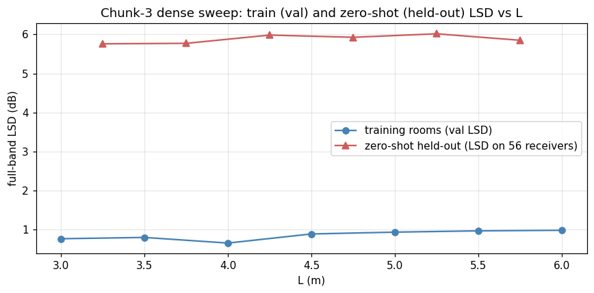

# Chunk-3 dense-sweep multi-room — cross-room summary

Generated by `scripts/multi_room_summary.py`. One auto-decoder model trained on the 7 dense-sweep training rooms; zero-shot adaptation on 6 unseen L values.

## Training metadata
- iters: 30000 / 30000  (completed full)
- wall-clock: 158.3 min  (2.64 h)
- final val total weighted loss: 0.858 dB (aggregated full-band LSD)

## Per-training-room reconstruction (final val)
| L (m) | LSD (dB) | complex L1 | magnitude L1 | phase L1 |
|------:|---------:|-----------:|-------------:|---------:|
| 3.00 | 0.77 | 0.1097 | 0.0632 | 0.119 |
| 3.50 | 0.80 | 0.1115 | 0.0622 | 0.133 |
| 4.00 | 0.66 | 0.0800 | 0.0467 | 0.100 |
| 4.50 | 0.89 | 0.1117 | 0.0608 | 0.155 |
| 5.00 | 0.94 | 0.1082 | 0.0589 | 0.164 |
| 5.50 | 0.97 | 0.1097 | 0.0591 | 0.172 |
| 6.00 | 0.98 | 0.1070 | 0.0569 | 0.178 |

## Zero-shot adaptation at unseen L
| L (m) | obs LSD (dB) | held-out LSD (dB) | held-out complex L1 | modal MAE (Hz) | modal recall | n picked / n analytical |
|------:|-------------:|------------------:|--------------------:|---------------:|-------------:|------------------------:|
| 3.25 | 5.10 | 5.76 | 0.7999 | 0.59 | 0.059 | 87 / 1416 |
| 3.75 | 5.00 | 5.77 | 0.7773 | 0.57 | 0.061 | 101 / 1611 |
| 4.25 | 5.08 | 5.98 | 0.7112 | 0.60 | 0.053 | 98 / 1845 |
| 4.75 | 4.86 | 5.93 | 0.6778 | 0.58 | 0.044 | 91 / 2049 |
| 5.25 | 4.89 | 6.02 | 0.7074 | 0.55 | 0.043 | 96 / 2253 |
| 5.75 | 4.70 | 5.85 | 0.7219 | 0.50 | 0.041 | 102 / 2475 |

## Latent manifold probe (PCA)
- intrinsic_dim (95% variance): **10**
- PC1 vs L linear-fit R²: **-0.634**
- slope of PC1 vs L: 0.037 per m
- per-PC explained variance: ['0.262', '0.209', '0.106', '0.076', '0.073', '0.063']
- See `latent_probe/figures/{latent_pca_1d, latent_pca_2d, latent_variance}.png`

## Cross-L LSD

## Per-zero-shot-L artifacts
- L=3.25: [overlay](zero_shot/L3.25/figures/zero_shot_overlay.png), [modal_tracking](zero_shot/L3.25/figures/zero_shot_modal_tracking.png), [receiver_grid](zero_shot/L3.25/figures/zero_shot_receiver_grid.png), [adapt_loss](zero_shot/L3.25/figures/adapt_loss_curve.png)
- L=3.75: [overlay](zero_shot/L3.75/figures/zero_shot_overlay.png), [modal_tracking](zero_shot/L3.75/figures/zero_shot_modal_tracking.png), [receiver_grid](zero_shot/L3.75/figures/zero_shot_receiver_grid.png), [adapt_loss](zero_shot/L3.75/figures/adapt_loss_curve.png)
- L=4.25: [overlay](zero_shot/L4.25/figures/zero_shot_overlay.png), [modal_tracking](zero_shot/L4.25/figures/zero_shot_modal_tracking.png), [receiver_grid](zero_shot/L4.25/figures/zero_shot_receiver_grid.png), [adapt_loss](zero_shot/L4.25/figures/adapt_loss_curve.png)
- L=4.75: [overlay](zero_shot/L4.75/figures/zero_shot_overlay.png), [modal_tracking](zero_shot/L4.75/figures/zero_shot_modal_tracking.png), [receiver_grid](zero_shot/L4.75/figures/zero_shot_receiver_grid.png), [adapt_loss](zero_shot/L4.75/figures/adapt_loss_curve.png)
- L=5.25: [overlay](zero_shot/L5.25/figures/zero_shot_overlay.png), [modal_tracking](zero_shot/L5.25/figures/zero_shot_modal_tracking.png), [receiver_grid](zero_shot/L5.25/figures/zero_shot_receiver_grid.png), [adapt_loss](zero_shot/L5.25/figures/adapt_loss_curve.png)
- L=5.75: [overlay](zero_shot/L5.75/figures/zero_shot_overlay.png), [modal_tracking](zero_shot/L5.75/figures/zero_shot_modal_tracking.png), [receiver_grid](zero_shot/L5.75/figures/zero_shot_receiver_grid.png), [adapt_loss](zero_shot/L5.75/figures/adapt_loss_curve.png)
