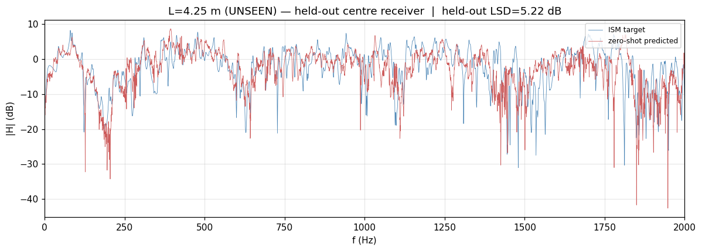
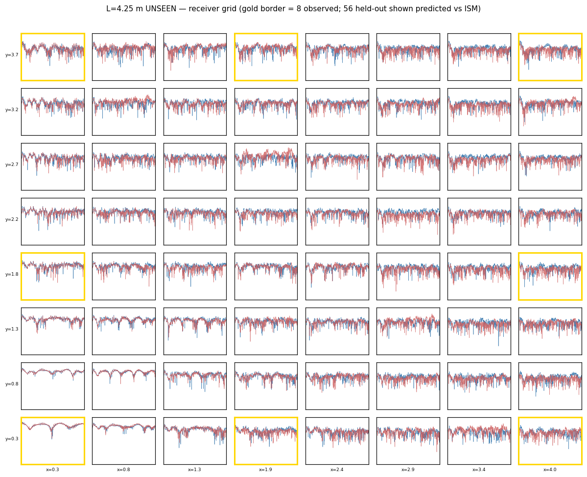
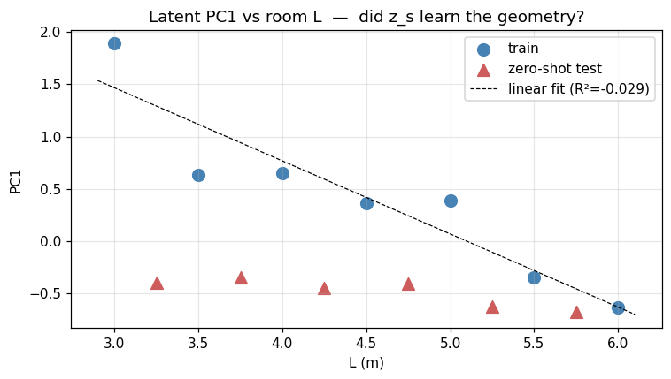
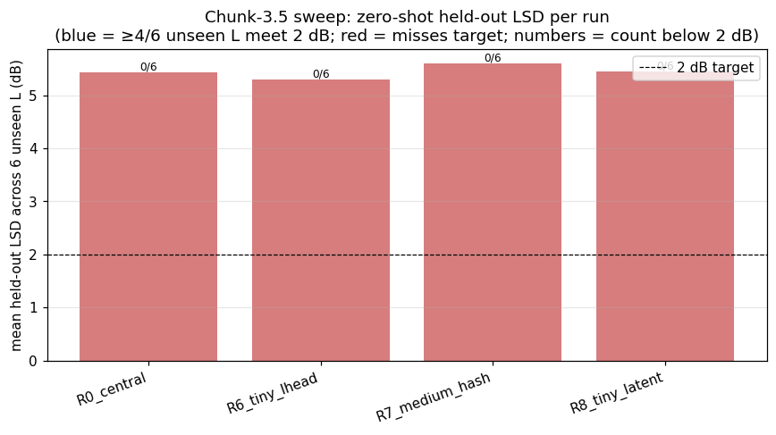

# Chunk-3.5 sweep summary

Generated by `scripts/sweep_summary.py` after the full pipeline completes.

## 1. Configuration table
| Run | log2_hash | n_levels | latent_dim | L-head wt | λ_latent_L2 |
|-----|---------:|---------:|-----------:|----------:|------------:|
| R0_central | 14 | 14 | 8 | 0.1 | 1e-4 |
| R1_smaller_hash | 12 | 14 | 8 | 0.1 | 1e-4 |
| R2_larger_latent | 14 | 14 | 16 | 0.1 | 1e-4 |
| R3_no_lhead | 14 | 14 | 8 | 0.0 | 1e-4 |
| R4_strong_lhead | 14 | 14 | 8 | 1.0 | 1e-4 |
| R5_strong_l2 | 14 | 14 | 8 | 0.1 | 1e-2 |
| R6_tiny_lhead | 14 | 14 | 8 | 0.1 | 1e-4 |
| R7_medium_hash | 16 | 16 | 8 | 0.1 | 1e-4 |
| R8_tiny_latent | 14 | 14 | 2 | 0.1 | 1e-4 |

## 2. Per-run results table
| Run | Status | Train agg LSD (dB) | ZS mean held LSD (dB) | ZS LSD ≤ 2 dB | PC1-vs-L R² | intrinsic_dim |
|-----|--------|-------------------:|---------------------:|--------------:|------------:|--------------:|
| R0_central | completed | 1.403 | 5.422 | 0 / 6 | -0.020 | 5 |
| R1_smaller_hash | no train_meta | 1.776 | — | 0 / 6 | — | — |
| R2_larger_latent | no train_meta | 1.650 | — | 0 / 6 | — | — |
| R3_no_lhead | no train_meta | 1.570 | — | 0 / 6 | — | — |
| R4_strong_lhead | no train_meta | 1.689 | — | 0 / 6 | — | — |
| R5_strong_l2 | no train_meta | 1.585 | — | 0 / 6 | — | — |
| R6_tiny_lhead | completed | 1.449 | 5.296 | 0 / 6 | -0.029 | 6 |
| R7_medium_hash | completed | 1.294 | 5.589 | 0 / 6 | -0.277 | 6 |
| R8_tiny_latent | completed | 1.703 | 5.444 | 0 / 6 | -0.241 | 2 |

## 3. Best configuration
**R6_tiny_lhead** wins by the spec priority order (count below 2 dB → mean LSD → R² → train LSD).

- Train agg val LSD: **1.449 dB**
- ZS mean held-out LSD: **5.296 dB**
- ZS count below 2 dB: **0 / 6**
- PC1 vs L R²: **-0.029**
- intrinsic_dim (95% var): **6**
- L-head val MAE: **0.000 m**

**Meets full meeting bar?** No (targets: ZS ≤ 2 dB on ≥ 4/6 + PC1 R² > 0.7 + intrinsic_dim ≤ 3).

## 4. Ablation interpretation
- **R1_smaller_hash**: smaller hash (12 vs 14 bits) — run incomplete or missing
- **R2_larger_latent**: larger latent (16 vs 8 dims) — run incomplete or missing
- **R3_no_lhead**: no L-head (0.0 vs 0.1) — run incomplete or missing
- **R4_strong_lhead**: stronger L-head (1.0 vs 0.1) — run incomplete or missing
- **R5_strong_l2**: stronger latent L2 (1e-2 vs 1e-4) — run incomplete or missing
- **R6_tiny_lhead** vs R0 (linear L-head (vs mlp_32)): ZS mean held 5.296 dB (Δ -0.125 dB), ≤2dB count 0/6 (Δ +0), R² -0.029 (Δ -0.009).
- **R7_medium_hash** vs R0 (linear L-head + medium hash (16 vs 14)): ZS mean held 5.589 dB (Δ +0.168 dB), ≤2dB count 0/6 (Δ +0), R² -0.277 (Δ -0.257).
- **R8_tiny_latent** vs R0 (linear L-head + tiny latent (2 vs 8 dims)): ZS mean held 5.444 dB (Δ +0.023 dB), ≤2dB count 0/6 (Δ +0), R² -0.241 (Δ -0.221).

## 5. Headline figures
- 
- 
- 
- 

## 6. Per-run artifacts
- **R0_central**: [training_curves](R0_central/figures/training_curves.png), [latent PCA](R0_central/latent_probe/figures/latent_pca_1d.png), [ZS L=4.25 overlay](R0_central/zero_shot/L4.25/figures/zero_shot_overlay.png)
- **R1_smaller_hash**: [training_curves](R1_smaller_hash/figures/training_curves.png), [latent PCA](R1_smaller_hash/latent_probe/figures/latent_pca_1d.png), [ZS L=4.25 overlay](R1_smaller_hash/zero_shot/L4.25/figures/zero_shot_overlay.png)
- **R2_larger_latent**: [training_curves](R2_larger_latent/figures/training_curves.png), [latent PCA](R2_larger_latent/latent_probe/figures/latent_pca_1d.png), [ZS L=4.25 overlay](R2_larger_latent/zero_shot/L4.25/figures/zero_shot_overlay.png)
- **R3_no_lhead**: [training_curves](R3_no_lhead/figures/training_curves.png), [latent PCA](R3_no_lhead/latent_probe/figures/latent_pca_1d.png), [ZS L=4.25 overlay](R3_no_lhead/zero_shot/L4.25/figures/zero_shot_overlay.png)
- **R4_strong_lhead**: [training_curves](R4_strong_lhead/figures/training_curves.png), [latent PCA](R4_strong_lhead/latent_probe/figures/latent_pca_1d.png), [ZS L=4.25 overlay](R4_strong_lhead/zero_shot/L4.25/figures/zero_shot_overlay.png)
- **R5_strong_l2**: [training_curves](R5_strong_l2/figures/training_curves.png), [latent PCA](R5_strong_l2/latent_probe/figures/latent_pca_1d.png), [ZS L=4.25 overlay](R5_strong_l2/zero_shot/L4.25/figures/zero_shot_overlay.png)
- **R6_tiny_lhead**: [training_curves](R6_tiny_lhead/figures/training_curves.png), [latent PCA](R6_tiny_lhead/latent_probe/figures/latent_pca_1d.png), [ZS L=4.25 overlay](R6_tiny_lhead/zero_shot/L4.25/figures/zero_shot_overlay.png)
- **R7_medium_hash**: [training_curves](R7_medium_hash/figures/training_curves.png), [latent PCA](R7_medium_hash/latent_probe/figures/latent_pca_1d.png), [ZS L=4.25 overlay](R7_medium_hash/zero_shot/L4.25/figures/zero_shot_overlay.png)
- **R8_tiny_latent**: [training_curves](R8_tiny_latent/figures/training_curves.png), [latent PCA](R8_tiny_latent/latent_probe/figures/latent_pca_1d.png), [ZS L=4.25 overlay](R8_tiny_latent/zero_shot/L4.25/figures/zero_shot_overlay.png)

## 7. Recommendations for next steps
- **R6_tiny_lhead** is the best of the sweep but does not meet the full meeting bar. Likely next experiments: see CHUNK_3_5_RESULTS.md ablation interpretation.
