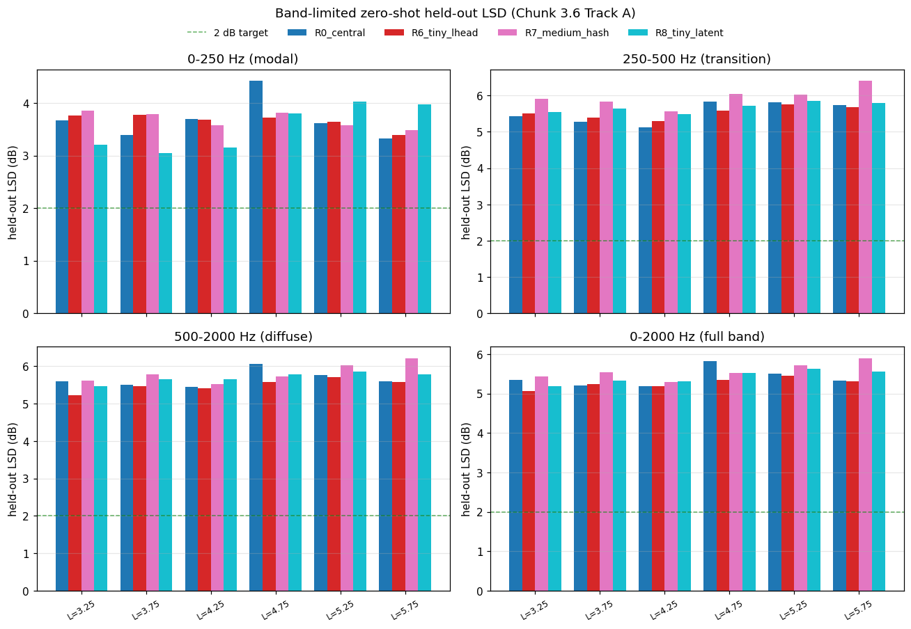

# Band-limited zero-shot LSD summary (Chunk 3.6 Track A)

Recomputed from saved z_star.pt for each (run, L) — no inner-loop re-adaptation.
LSD is mean ``|20*log10(|H_pred|/|H_target|)|`` over the 56 held-out receivers and the bins inside each band.

Bands: modal (0-250 Hz), transition (250-500 Hz), diffuse (500-2000 Hz), full (0-2000 Hz).
Target for the meeting deliverable: ≤ 2 dB on ≥ 4/6 unseen L (modal regime).

| Run | Band | mean LSD (dB) | min | max | count ≤ 2 dB | count ≤ 3 dB | n L |
|---|---|---:|---:|---:|---:|---:|---:|
| R0_central | 0-250 Hz (modal) | 3.69 | 3.32 | 4.42 | 0/6 | 0/6 | 6 |
| R0_central | 250-500 Hz (transition) | 5.54 | 5.12 | 5.84 | 0/6 | 0/6 | 6 |
| R0_central | 500-2000 Hz (diffuse) | 5.66 | 5.45 | 6.06 | 0/6 | 0/6 | 6 |
| R0_central | 0-2000 Hz (full band) | 5.40 | 5.19 | 5.83 | 0/6 | 0/6 | 6 |
| R6_tiny_lhead | 0-250 Hz (modal) | 3.66 | 3.39 | 3.78 | 0/6 | 0/6 | 6 |
| R6_tiny_lhead | 250-500 Hz (transition) | 5.53 | 5.30 | 5.75 | 0/6 | 0/6 | 6 |
| R6_tiny_lhead | 500-2000 Hz (diffuse) | 5.49 | 5.22 | 5.72 | 0/6 | 0/6 | 6 |
| R6_tiny_lhead | 0-2000 Hz (full band) | 5.27 | 5.07 | 5.46 | 0/6 | 0/6 | 6 |
| R7_medium_hash | 0-250 Hz (modal) | 3.68 | 3.49 | 3.85 | 0/6 | 0/6 | 6 |
| R7_medium_hash | 250-500 Hz (transition) | 5.96 | 5.57 | 6.40 | 0/6 | 0/6 | 6 |
| R7_medium_hash | 500-2000 Hz (diffuse) | 5.81 | 5.52 | 6.21 | 0/6 | 0/6 | 6 |
| R7_medium_hash | 0-2000 Hz (full band) | 5.57 | 5.29 | 5.89 | 0/6 | 0/6 | 6 |
| R8_tiny_latent | 0-250 Hz (modal) | 3.54 | 3.05 | 4.03 | 0/6 | 0/6 | 6 |
| R8_tiny_latent | 250-500 Hz (transition) | 5.68 | 5.49 | 5.86 | 0/6 | 0/6 | 6 |
| R8_tiny_latent | 500-2000 Hz (diffuse) | 5.70 | 5.46 | 5.86 | 0/6 | 0/6 | 6 |
| R8_tiny_latent | 0-2000 Hz (full band) | 5.42 | 5.19 | 5.63 | 0/6 | 0/6 | 6 |

## Headline figure

## Notes

- These numbers reuse the EXACT z_star produced by the original Chunk-3.5 zero-shot runs.
- The full-band column matches the existing `held_out_lsd_db` field in `metrics.json` modulo numerical noise — sanity check.
- Track B variants (different inner-loop strategies) are aggregated in `outputs/inner_loop_experiments/SUMMARY.md`.
