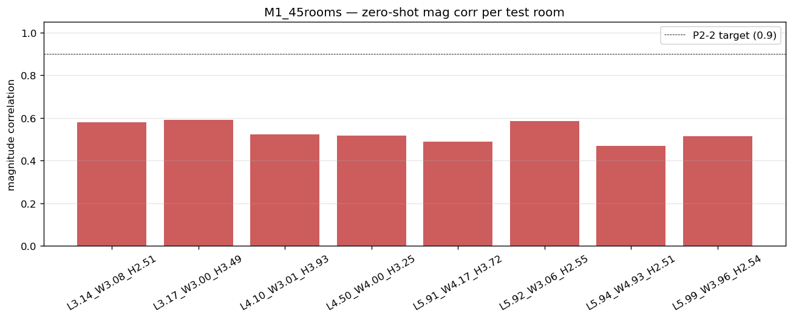

# Multi-room 3D zero-shot summary — M1_45rooms

Metrics aggregated from each test room's `metrics.json` (held-out subset).

**Headline**: 0/8 rooms reach mag corr ≥ 0.9 (full spectrum).
(Target: ≥ 5/8 per P2-2 acceptance criteria.)

## Per-room metrics (held-out)
| Run | L | W | H | V (m³) | f_S (Hz) | mod MAE (Hz) | LSD (dB) full | mag corr | phase corr mw | RIR Pearson | env corr | early/late | geom err L/W/H (m) |
|---|---:|---:|---:|------:|------:|---:|---:|---:|---:|---:|---:|------:|---|
| L3.14_W3.08_H2.51 | 3.14 | 3.08 | 2.51 | 24.2 | 292 | 1.30 | 9.31 | 0.580 | 0.195 | 0.360 | 0.733 | 0.38 / 0.33 | 0.15 / 0.32 / 0.23 |
| L3.17_W3.00_H3.49 | 3.17 | 3.00 | 3.49 | 33.2 | 263 | 0.64 | 7.61 | 0.590 | 0.208 | 0.408 | 0.752 | 0.39 / 0.41 | 0.15 / 0.37 / 0.04 |
| L4.10_W3.01_H3.93 | 4.10 | 3.01 | 3.93 | 48.5 | 231 | 1.19 | 7.40 | 0.523 | 0.186 | 0.355 | 0.726 | 0.35 / 0.35 | 0.07 / 0.40 / 0.63 |
| L4.50_W4.00_H3.25 | 4.50 | 4.00 | 3.25 | 58.5 | 217 | 0.89 | 6.86 | 0.518 | 0.189 | 0.359 | 0.725 | 0.39 / 0.28 | 0.04 / 0.37 / 0.10 |
| L5.91_W4.17_H3.72 | 5.91 | 4.17 | 3.72 | 91.7 | 186 | 1.05 | 6.54 | 0.487 | 0.155 | 0.291 | 0.664 | 0.35 / 0.19 | 0.44 / 0.07 / 0.00 |
| L5.92_W3.06_H2.55 | 5.92 | 3.06 | 2.55 | 46.3 | 229 | 0.94 | 7.56 | 0.586 | 0.186 | 0.385 | 0.730 | 0.40 / 0.35 | 0.15 / 0.51 / 0.15 |
| L5.94_W4.93_H2.51 | 5.94 | 4.93 | 2.51 | 73.5 | 195 | 1.09 | 7.13 | 0.467 | 0.146 | 0.265 | 0.652 | 0.32 / 0.16 | 0.60 / 1.31 / 0.14 |
| L5.99_W3.96_H2.54 | 5.99 | 3.96 | 2.54 | 60.1 | 210 | 0.77 | 7.58 | 0.513 | 0.157 | 0.301 | 0.670 | 0.36 / 0.21 | 0.68 / 0.75 / 0.36 |

## Per-band LSD (held-out)
| Run | 0-250 (dB) | 250-500 (dB) | 500-1000 (dB) | 1000-2000 (dB) |
|---|---:|---:|---:|---:|
| L3.14_W3.08_H2.51 | 6.90 | 9.31 | 9.56 | 9.81 |
| L3.17_W3.00_H3.49 | 5.19 | 7.94 | 7.75 | 8.08 |
| L4.10_W3.01_H3.93 | 5.17 | 7.56 | 7.69 | 7.77 |
| L4.50_W4.00_H3.25 | 5.02 | 7.08 | 7.16 | 7.12 |
| L5.91_W4.17_H3.72 | 5.45 | 6.94 | 6.88 | 6.56 |
| L5.92_W3.06_H2.55 | 5.54 | 7.56 | 7.85 | 7.93 |
| L5.94_W4.93_H2.51 | 5.86 | 7.32 | 7.48 | 7.25 |
| L5.99_W3.96_H2.54 | 5.79 | 7.66 | 8.00 | 7.83 |

## Magnitude correlation per room

