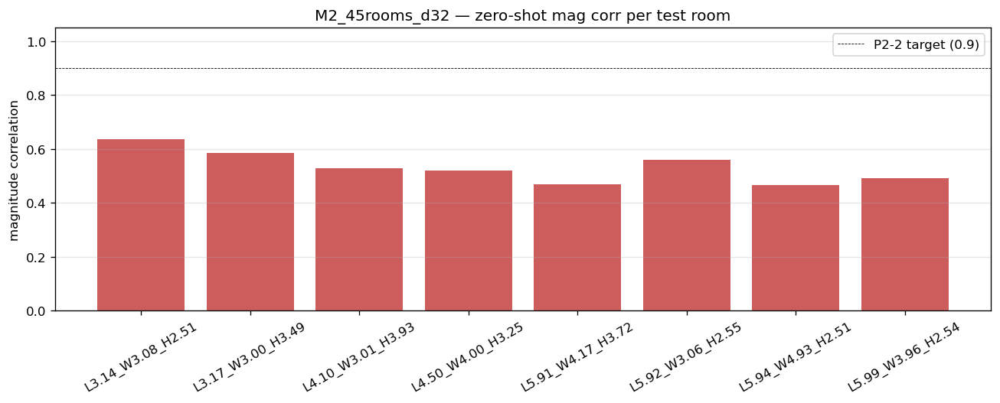

# Multi-room 3D zero-shot summary — M2_45rooms_d32

Metrics aggregated from each test room's `metrics.json` (held-out subset).

**Headline**: 0/8 rooms reach mag corr ≥ 0.9 (full spectrum).
(Target: ≥ 5/8 per P2-2 acceptance criteria.)

## Per-room metrics (held-out)
| Run | L | W | H | V (m³) | f_S (Hz) | mod MAE (Hz) | LSD (dB) full | mag corr | phase corr mw | RIR Pearson | env corr | early/late | geom err L/W/H (m) |
|---|---:|---:|---:|------:|------:|---:|---:|---:|---:|---:|---:|------:|---|
| L3.14_W3.08_H2.51 | 3.14 | 3.08 | 2.51 | 24.2 | 292 | 1.21 | 7.71 | 0.636 | 0.172 | 0.401 | 0.724 | 0.38 / 0.43 | 0.43 / 0.22 / 0.69 |
| L3.17_W3.00_H3.49 | 3.17 | 3.00 | 3.49 | 33.2 | 263 | 0.92 | 7.02 | 0.586 | 0.172 | 0.379 | 0.720 | 0.37 / 0.38 | 0.01 / 0.93 / 0.20 |
| L4.10_W3.01_H3.93 | 4.10 | 3.01 | 3.93 | 48.5 | 231 | 1.16 | 7.00 | 0.528 | 0.145 | 0.319 | 0.694 | 0.33 / 0.30 | 1.03 / 0.84 / 0.78 |
| L4.50_W4.00_H3.25 | 4.50 | 4.00 | 3.25 | 58.5 | 217 | 0.71 | 6.79 | 0.519 | 0.153 | 0.326 | 0.695 | 0.37 / 0.24 | 0.73 / 0.16 / 0.46 |
| L5.91_W4.17_H3.72 | 5.91 | 4.17 | 3.72 | 91.7 | 186 | 0.51 | 6.45 | 0.470 | 0.125 | 0.246 | 0.634 | 0.33 / 0.13 | 0.54 / 0.58 / 0.72 |
| L5.92_W3.06_H2.55 | 5.92 | 3.06 | 2.55 | 46.3 | 229 | 1.11 | 7.15 | 0.561 | 0.145 | 0.329 | 0.695 | 0.35 / 0.29 | 1.88 / 0.63 / 0.71 |
| L5.94_W4.93_H2.51 | 5.94 | 4.93 | 2.51 | 73.5 | 195 | 0.97 | 7.18 | 0.465 | 0.114 | 0.221 | 0.618 | 0.29 / 0.13 | 0.50 / 0.01 / 0.59 |
| L5.99_W3.96_H2.54 | 5.99 | 3.96 | 2.54 | 60.1 | 210 | 0.91 | 6.94 | 0.492 | 0.124 | 0.244 | 0.622 | 0.32 / 0.15 | 0.08 / 0.54 / 0.27 |

## Per-band LSD (held-out)
| Run | 0-250 (dB) | 250-500 (dB) | 500-1000 (dB) | 1000-2000 (dB) |
|---|---:|---:|---:|---:|
| L3.14_W3.08_H2.51 | 6.11 | 7.94 | 7.65 | 8.09 |
| L3.17_W3.00_H3.49 | 5.17 | 7.32 | 6.94 | 7.47 |
| L4.10_W3.01_H3.93 | 5.22 | 7.22 | 7.08 | 7.38 |
| L4.50_W4.00_H3.25 | 5.14 | 7.05 | 6.83 | 7.14 |
| L5.91_W4.17_H3.72 | 5.57 | 6.47 | 6.39 | 6.73 |
| L5.92_W3.06_H2.55 | 5.44 | 7.22 | 7.43 | 7.42 |
| L5.94_W4.93_H2.51 | 6.09 | 7.69 | 7.13 | 7.38 |
| L5.99_W3.96_H2.54 | 5.79 | 7.13 | 7.14 | 7.11 |

## Magnitude correlation per room

