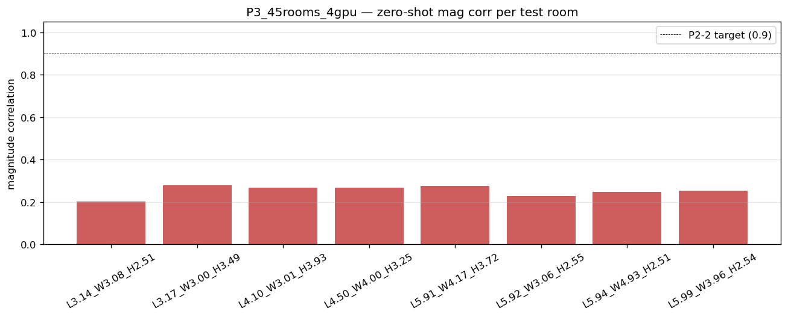

# Multi-room 3D zero-shot summary — P3_45rooms_4gpu

Metrics aggregated from each test room's `metrics.json` (held-out subset).

## Self-diagnosis verdict (D37)

**BELOW TARGET — 0/8 succeed; the dominant failure is MANIFOLD-COVERAGE (8 rooms: z* geometrically misplaced) → fix is more training rooms (P2-4), not more iters/capacity.**

- In-distribution gate: in-distribution val LSD = **2.17 dB** @ 60000 iters → **gate PASSED** (≤ 2.5)
- Zero-shot headline: 0/8 rooms reach mag corr ≥ 0.9 (full spectrum; target ≥ 5/8).
- Per-room branch ∈ {success, manifold_coverage (→ P2-4 more rooms), decoder_interp (→ decoder smoothness), precondition_unmet}.

## Per-room metrics (held-out)
| Run | L | W | H | V (m³) | mod MAE (Hz) | LSD full | mag corr | phase mw | RIR ρ | env ρ | geom err L/W/H (m) | z* dist (min/geom-nn) | branch |
|---|---:|---:|---:|------:|---:|---:|---:|---:|---:|---:|---|---|---|
| L3.14_W3.08_H2.51 | 3.14 | 3.08 | 2.51 | 24.2 | 0.91 | 8.31 | 0.201 | 0.115 | 0.111 | 0.778 | 0.01 / 0.54 / 0.19 | 7.30 / 11.05 | manifold_coverage |
| L3.17_W3.00_H3.49 | 3.17 | 3.00 | 3.49 | 33.2 | 1.29 | 6.98 | 0.278 | 0.129 | 0.137 | 0.777 | 0.79 / 0.71 / 1.34 | 7.23 / 10.24 | manifold_coverage |
| L4.10_W3.01_H3.93 | 4.10 | 3.01 | 3.93 | 48.5 | 1.01 | 7.95 | 0.266 | 0.086 | 0.097 | 0.768 | 1.06 / 0.55 / 1.70 | 8.41 / 12.21 | manifold_coverage |
| L4.50_W4.00_H3.25 | 4.50 | 4.00 | 3.25 | 58.5 | 1.17 | 8.56 | 0.268 | 0.076 | 0.091 | 0.764 | 1.52 / 1.72 / 1.13 | 9.51 / 12.37 | manifold_coverage |
| L5.91_W4.17_H3.72 | 5.91 | 4.17 | 3.72 | 91.7 | 0.60 | 7.86 | 0.276 | 0.072 | 0.080 | 0.749 | 1.92 / 1.42 / 1.28 | 9.11 / 9.11 | manifold_coverage |
| L5.92_W3.06_H2.55 | 5.92 | 3.06 | 2.55 | 46.3 | 1.24 | 7.32 | 0.228 | 0.107 | 0.107 | 0.768 | 1.80 / 0.54 / 0.20 | 7.89 / 9.73 | manifold_coverage |
| L5.94_W4.93_H2.51 | 5.94 | 4.93 | 2.51 | 73.5 | 0.78 | 8.12 | 0.248 | 0.066 | 0.071 | 0.756 | 2.40 / 2.46 / 0.34 | 8.56 / 10.63 | manifold_coverage |
| L5.99_W3.96_H2.54 | 5.99 | 3.96 | 2.54 | 60.1 | 0.86 | 7.61 | 0.252 | 0.080 | 0.080 | 0.763 | 2.64 / 0.84 / 0.10 | 7.93 / 10.66 | manifold_coverage |

## Per-band LSD (held-out)
| Run | 0-250 (dB) | 250-500 (dB) | 500-1000 (dB) | 1000-2000 (dB) |
|---|---:|---:|---:|---:|
| L3.14_W3.08_H2.51 | 8.32 | 7.95 | 7.92 | 8.57 |
| L3.17_W3.00_H3.49 | 7.46 | 6.78 | 6.70 | 7.06 |
| L4.10_W3.01_H3.93 | 7.24 | 7.56 | 7.51 | 8.43 |
| L4.50_W4.00_H3.25 | 6.92 | 7.81 | 7.94 | 9.41 |
| L5.91_W4.17_H3.72 | 7.01 | 7.83 | 7.71 | 8.16 |
| L5.92_W3.06_H2.55 | 7.85 | 7.24 | 7.09 | 7.32 |
| L5.94_W4.93_H2.51 | 7.36 | 8.06 | 7.92 | 8.42 |
| L5.99_W3.96_H2.54 | 7.45 | 7.48 | 7.46 | 7.76 |

## Magnitude correlation per room

