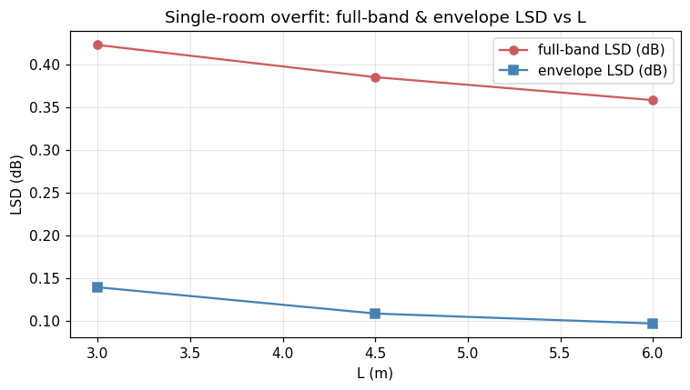

# Single-room overfit baseline — cross-room summary

Generated by `scripts/single_room_summary.py`. One per-room model trained per L.

## Per-room metrics
| L (m) | ckpt iter | f_S (Hz) | modal MAE (Hz) | modal recall | full LSD (dB) | env LSD (dB) | complex L1 | mag L1 | phase L1 |
|------:|---------:|---------:|---------------:|-------------:|--------------:|-------------:|-----------:|-------:|---------:|
| 3.00 | 10000 | 554 | 0.34 | 0.160 | 0.42 | 0.14 | 0.0581 | 0.0350 | 0.059 |
| 4.50 | 10000 | 503 | 0.58 | 0.123 | 0.39 | 0.11 | 0.0404 | 0.0241 | 0.054 |
| 6.00 | 10000 | 463 | 0.45 | 0.172 | 0.36 | 0.10 | 0.0329 | 0.0193 | 0.055 |

## ISM baseline (centre receiver picker recall)
For comparison, the ISM-vs-analytical recall at the centre receiver per room (from the noise-floor pipeline). Our model can't beat this — it's an upper bound.

| L (m) | ISM modal recall |
|------:|-----------------:|
| 3.00 | 0.149 |
| 4.50 | 0.123 |
| 6.00 | 0.172 |

## Per-band modal recall (predicted)
| L (m) | low (≤5) | mid (6–15) | high (16+) |
|--:|---------:|-----------:|-----------:|
| 3.00 | 0.50 (3/6) | 0.30 (3/10) | 0.12 (9/78) |
| 4.50 | 0.50 (3/6) | 0.20 (2/10) | 0.10 (11/114) |
| 6.00 | 0.67 (4/6) | 0.20 (2/10) | 0.14 (15/106) |

## Per-room artifacts
- L=3.00: [training_curves](L3.0/figures/training_curves.png), [modal_tracking](L3.0/figures/modal_tracking.png), [spectrum_overlay](L3.0/figures/spectrum_overlay.png), [receiver_grid](L3.0/figures/receiver_grid.png) — [eval.json](L3.0/eval.json)
- L=4.50: [training_curves](L4.5/figures/training_curves.png), [modal_tracking](L4.5/figures/modal_tracking.png), [spectrum_overlay](L4.5/figures/spectrum_overlay.png), [receiver_grid](L4.5/figures/receiver_grid.png) — [eval.json](L4.5/eval.json)
- L=6.00: [training_curves](L6.0/figures/training_curves.png), [modal_tracking](L6.0/figures/modal_tracking.png), [spectrum_overlay](L6.0/figures/spectrum_overlay.png), [receiver_grid](L6.0/figures/receiver_grid.png) — [eval.json](L6.0/eval.json)

## Cross-room LSD vs L

