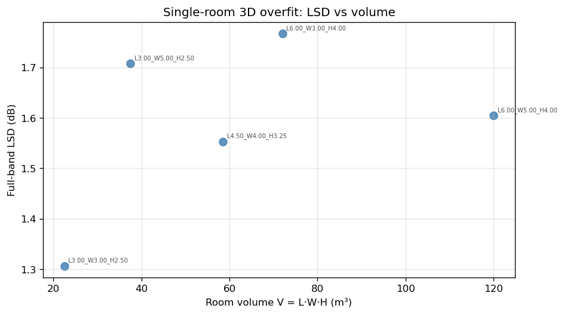

# Single-room 3D summary (P2-1)

Aggregated from each de-risk room's `eval.json`. Modal MAE is reported
in the f<f_Schroeder band only (DECISIONS.md D18 — above f_Schroeder,
3D modal density exceeds the RFFT resolution Δf=0.5 Hz).

## Per-room metrics
| Run | L | W | H | V (m³) | ckpt | f_S (Hz) | modal MAE (Hz) | LSD (dB) | mag corr | phase corr (mw) | RIR Pearson | EDC RMS (dB) | early/late | env corr |
|---|---:|---:|---:|------:|------:|---------:|----------------:|---------:|---------:|----------------:|-----------:|-------------:|-----------|---------:|
| L3.00_W3.00_H2.50 | 3.00 | 3.00 | 2.50 | 22.5 | 15000 | 299 | 1.18 | 1.31 | 0.983 | 0.981 | 0.987 | 51.05 | 0.99 / 0.98 | 0.994 |
| L3.00_W5.00_H2.50 | 3.00 | 5.00 | 2.50 | 37.5 | 15000 | 248 | 1.13 | 1.71 | 0.965 | 0.963 | 0.973 | 51.85 | 0.99 / 0.95 | 0.986 |
| L4.50_W4.00_H3.25 | 4.50 | 4.00 | 3.25 | 58.5 | 15000 | 217 | 0.61 | 1.55 | 0.967 | 0.968 | 0.976 | 51.55 | 0.99 / 0.96 | 0.988 |
| L6.00_W3.00_H4.00 | 6.00 | 3.00 | 4.00 | 72.0 | 15000 | 199 | 0.61 | 1.77 | 0.954 | 0.954 | 0.965 | 52.94 | 0.98 / 0.94 | 0.982 |
| L6.00_W5.00_H4.00 | 6.00 | 5.00 | 4.00 | 120.0 | 15000 | 170 | 0.67 | 1.60 | 0.954 | 0.955 | 0.965 | 52.99 | 0.98 / 0.94 | 0.982 |

## Phase-1 (2D) baseline reference
See [`outputs/single_room/SUMMARY.md`](outputs/single_room/SUMMARY.md). Modal MAE 0.34–0.58 Hz on matched peaks; full-band LSD 0.36–0.42 dB.

## LSD vs room volume

